## Python on Windows ##

+ Python for Windows can be downloaded from: <http://www.python.org/download/releases/2.7.5/>. It is recommended to install release 2.7.5, but most versions should work fine for what we do in the course.

Screenshots of the install process are given below.

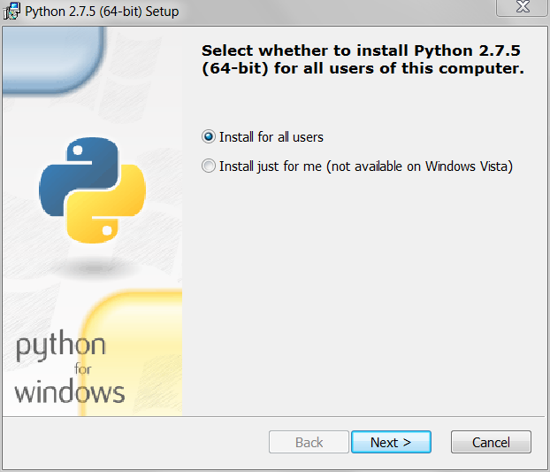 
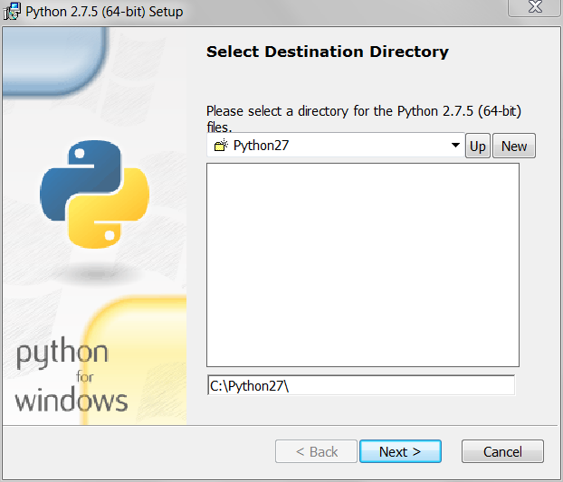 
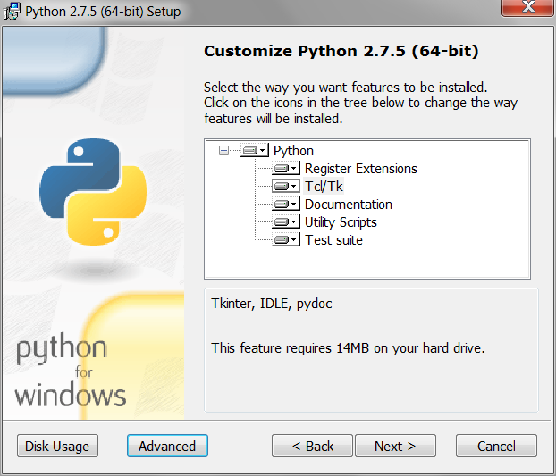 
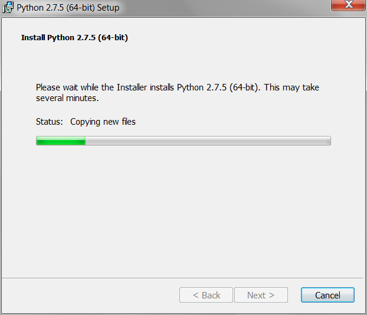 
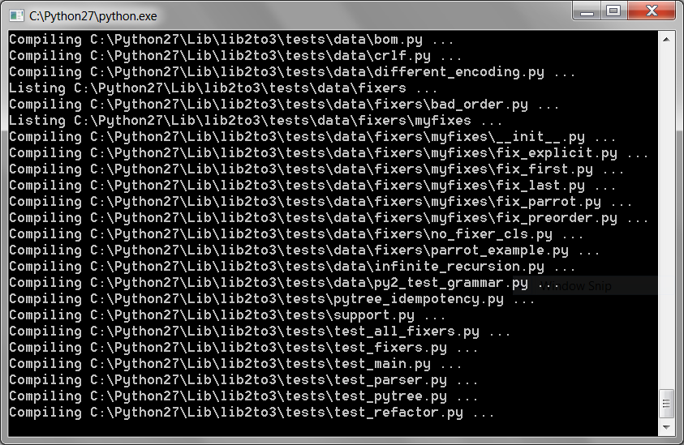 
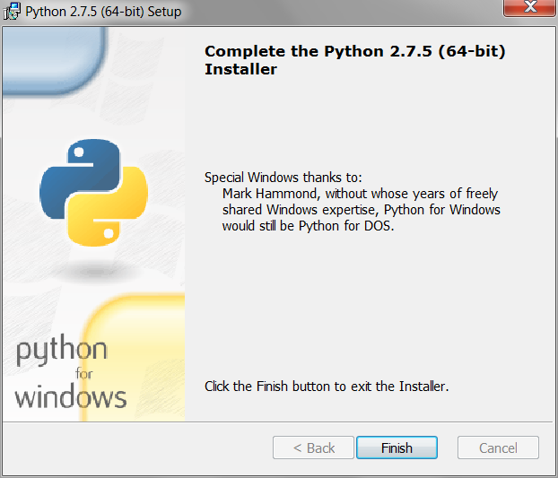 

Once installed, you should also install the `numpy` and `matplotlib` modules from <http://www.lfd.uci.edu/~gohlke/pythonlibs/#numpy> and <http://www.lfd.uci.edu/~gohlke/pythonlibs/#matplotlib>.

+ The recommended IDE of Python is PyCharm. It can be downloaded (for free) from: <http://www.jetbrains.com/pycharm/download/>

Screenshots of the install process are given below:

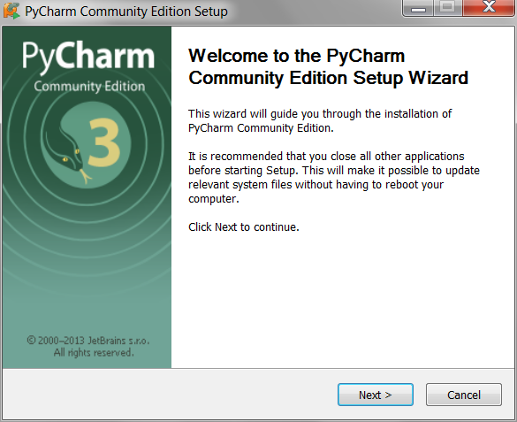 
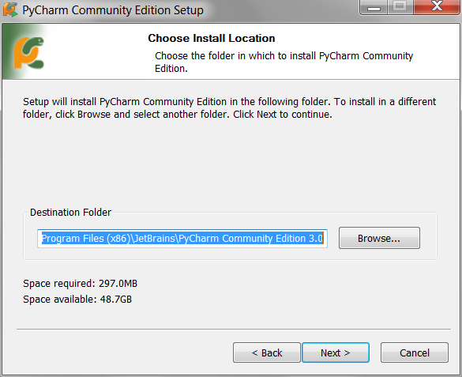 
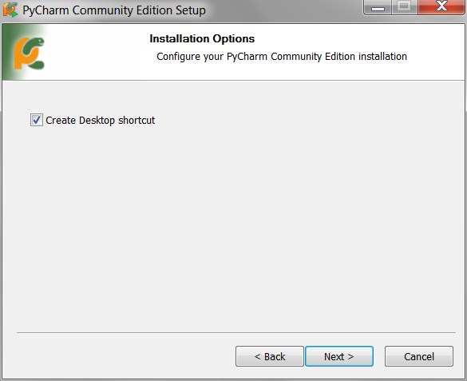 
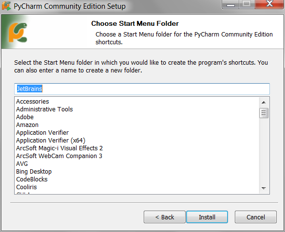 
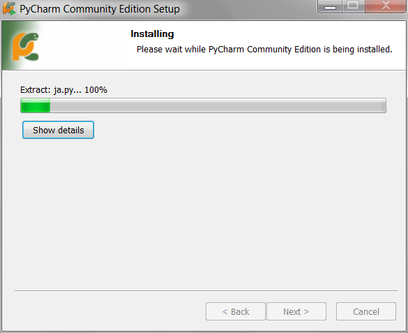 
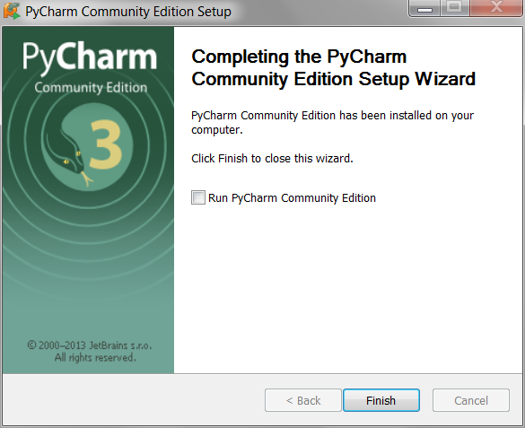 
Now you can start a new project in PyCharm. First, you'll need to tell PyCharm
where to find your Python install by selecting the "Interpreter", clicking on the
"+" button and adding your Python install. 
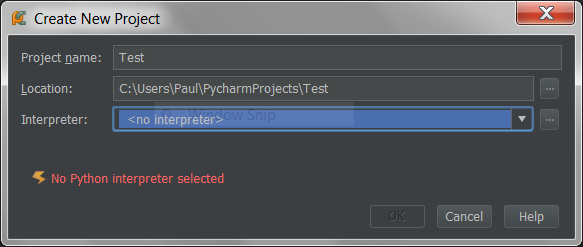 
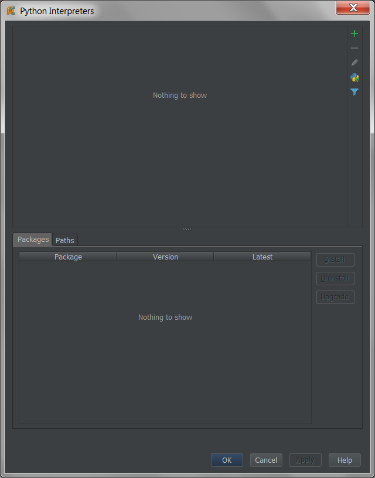 
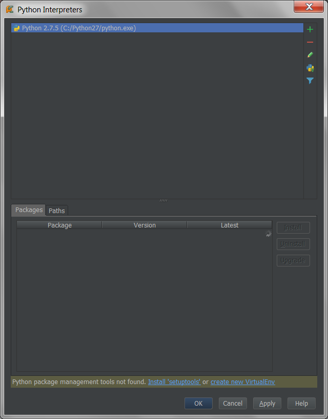 
Everything is now set up, so you can code away! 
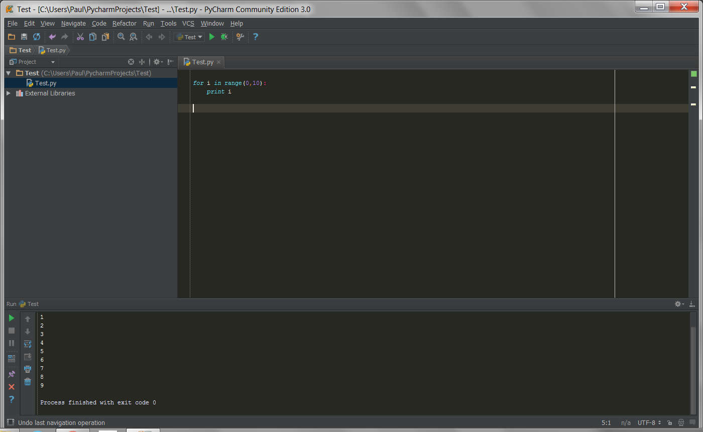 

## R on Windows ##

Setting up R on Windows is relatively straightforward. R can be downloaded from <http://www.r-project.org>. The recommended IDE for R is RStudio, which can be downloaded for free from <http://www.rstudio.com>.
